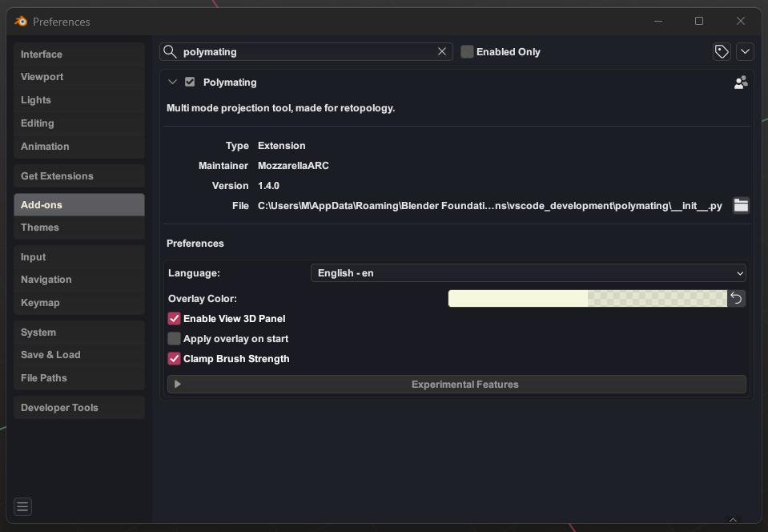
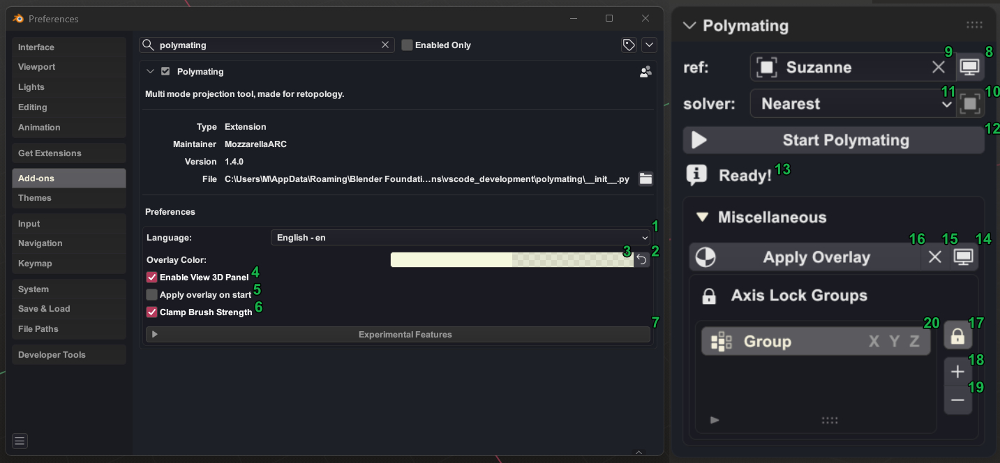
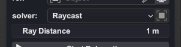
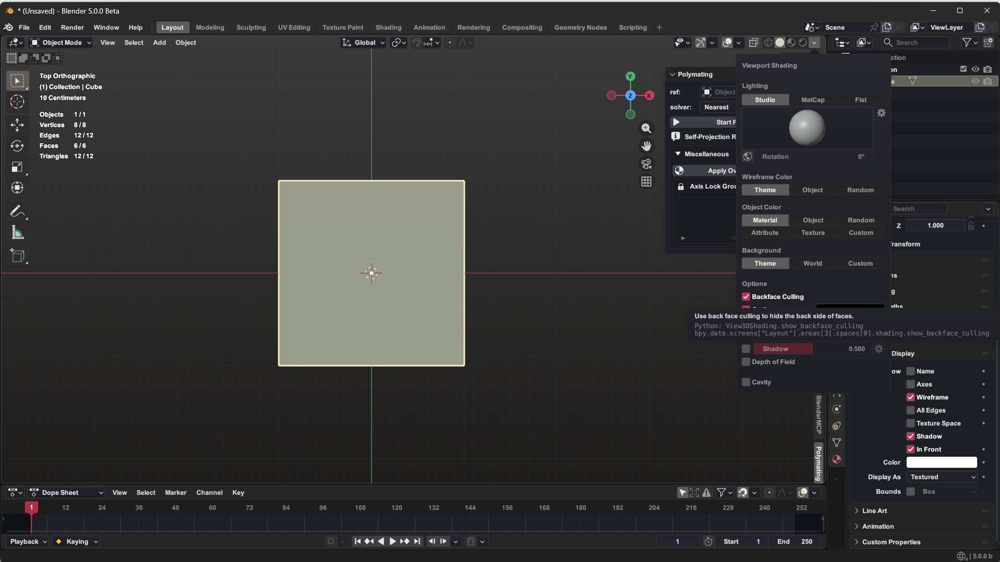
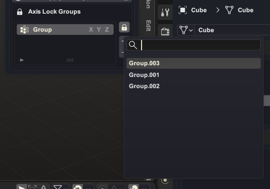
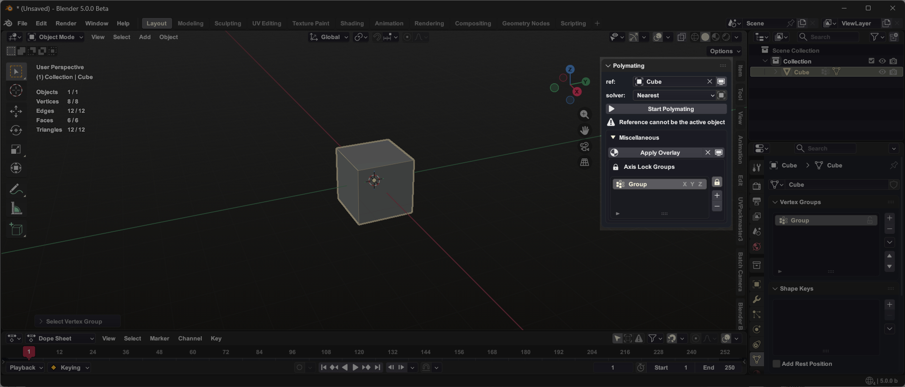

# ***Polymating User Guide for 1.4+***
### _A page for user instructions and manuals_


Hello, MozzarellaARC here, welcome to Polymating 1.4+ guide
For this version of Polymating, Johhny Boy will help us guide [Alaskan Malamute - Johnny Boy](https://www.fab.com/listings/bb6b5598-f803-4b19-931a-b31051dba204) please say hello to Johhny!


Before we start, I want to explain what Polymating is. It is a Blender retopology addon that uses a system similar to Blender's Shrinkwrap modifier. However, instead of a non-destructive retopology approach, Polymating updates all vertex transformations in real-time. Why? It was originally created to tackle a single problem: user event mismatch. As it evolved, Polymating began addressing another issue: integration.

As you know, Blender currently has three main modeling modes: Object Mode, Edit Mode, and Sculpt Mode. There is also an abundance of tools artists can use, not to mention the number of other modeling addons available. Polymating integrates with most of these tools because, at the core of the retopology pipeline, lies the projection of vertices and edge flow. This is where Polymating focuses its development.

Let's get started!!!
Download your blend. Learning material here [Johnny Boy](https://github.com/MozzarellaARC/PolymatingUserGuide/releases/tag/Learning)

## What's new?

In Polymating 1.4 the workflow is much less opinionated and users can do projection in a more personal manner. Polymating will no longer be tested on Blender version below 5.0 after this update comes to live although this version works on Blender 4.5 at the time of this writing.

Interface change:
- Improve the interface for vertex groups locking, it is now able to read multiple lock groups. With greater power comes greater responsibility as multiple group locking will add overhead proportional to both the number of vertices and the number of lock groups each vertex belongs. This might be improved later on.
- The menu for Polymating will now be able to be called through search.
- The panel for the View 3D region can now be hidden through preferences settings.

Projection Behavior update:
- Vertex locking are now more aggresive, as it no longer get bypassed by nearest solver and persist through solver changes.
- Projection now skips hidden vertices, including vertices that gets hidden with mask modifier, you might want to be careful when excluding the vertices using manual hiding because once the vertices are unhidden the projection will take effect immediately.
- Projection now respects masks made within the sculpt mode and this masks will persist through object mode and edit mode, this allows for a less opinionated workflow when working with specific vertices. Though this mask system has a different behavior than what you get when using hidden or vertex locking, as it has locking behaviour on the sculpt mode and in edit mode it does not project.

Performance update:
- Hidden vertices are partially evaluated to determine whether projection affects them. This means that when working with a mesh containing hidden vertices, those vertices introduce only a partial performance overhead, rather than doing the full calculation. This way you can work on a larger polycount base.
- The new list interface will allow you to have multiple lock groups running at the same time, but be careful the performance overhead is proportional to the complexity of the project see [Best Practices](#step-5---best-practices) section for more info.

## Installation and Preferences
Before we continue, I'm gonna introduce you to the ui of Polymating. The installation of Polymating will be pretty straight forward, after you download Polymating you can go to Edit > Preferences > Install > select the Polymating zip. file you have downloaded > Press the install add-on button > and turn on the check button, now that you've installed Polymating you will be shown the preferences ui like this :


## UI Introduction
Now that you have Polymating installed, let's take a look at how Polymating ui looks:



UI map:
1. Language - This is the dropdown menu to select which language the interface use, currently there is only 3 available language, English - en, 简体中文 - zh-CN (Simplified Chinese), and Indonesian - id.
2. Reset Color - This will reset the "Color preferences" (3) at its default value of #EAF0B9C6
3. Color preferences - This is would be the default material color when you applying material either through "Apply overlay on start" mechanism (1) or "Apply Overlay" (13)
4. Enable View 3D Panel- This would show the panel and the category on the View 3D UI
5. Apply overlay on start - When you press "Start Polymating" (11) it will automatically apply a material that is optimized for retopology and then turn on backface culling.
6. Clamp brush strength - When you press "Start Polymating" (11) it will automatically limit some of your brush strength to 0.5 in order to tone down the sensivity that would result a very jumpy wrapping at higher strength
7. Experimental Features - This is a collapsible menu to show or hide Experimental features, currently there is no experimental features.
8. Reference object visibility toggle.
9. Reference object picker.
10. Reference collection toggle - Whether to use a single object reference or collection based (multiple object) reference.
11. Solvers - There is 2 available solvers, Nearest and Raycast. Nearest would force project all the vertices to the nearest surface of the reference, while Raycast will treat the reference object as a collision therefore no projection will happen. When selecting Raycast solver, it will show Ray Distance menu like image below:
\
This Ray Distance will allow you to refine the behaviour of the Raycast, higher value for early stage of retopology and lower value on a more detailed retopology
12. Start Polymating - this is a toggle button, the main button to operate Polymating. It will show Start Polymating or Stop Polymating to tell you the state of the button
13. Info message - this is a message to show the state of Polymating, it roughly tells you what you need to do to operate Polymating
14. Overlay visibility - After overlay material is applied you can use this to toggle hide or show your object with overlay material
15. Remove Overlay- this button will remove all applied material created from Apply Overlay (13) or Apply overlay on start (1)
16. Apply Overlay - this button lets you apply an optimized material for retopology to your selected object, another thing to notice, this tool will turn on the "Backface Culling" option

which some people deemed unecessary.

17. Global lock - this will alow you enable/disable the vertex locking
18. Axis lock group add - clicking this tool will opens up picker prompt that shows available vertex groups that you can choose, like this image below 



you need to make sure to have a vertex group available that is not already part of the lock groups to open tis prompt.

19. Axis lock group remove
20. Axis lock groups lists - This new list interface will alow you to have multiple lock groups running at the same time, but be careful the performance overhead is proportional to the number of base vertices * (number of vertices that belongs to the lock groups * number of lock groups)

After everything is set, this is the default Polymating ui looks on your 3D viewport:



Now that you've learn the naming of things and where things are placed, let's get to the first step to the Polymating retopology pipeline:

*NOTES: Before we start with the tutorial, please keep in mind the interface is slightly changed in 1.4 as you can now use multiple lock groups, please make sure to revisit "What's new" section once you get the hang of Polymating*

## Step 1 - Bounding boxes
This is the most crucial moment for the pipeline because when you retopologizing with Polymating you preplaned the the edge flow instead of thinkering it on the run. The benefit of this is that you have more control for the edge flow over the whole mesh because you start with relatively simple shape and put the details later on just like with what you do when doing modeling or sculpting in general, so here is the example of doing the bounding boxing to our friend Johhny Boy:

https://github.com/user-attachments/assets/a2ebbcab-b617-4d32-8697-9589fdcb011a

For reference on this part it will roughly take around 2 minutes to create the bounding box, and this video is 5x for github compression. So take it into consideration when you doing this for getting paid, because time is at the essence.

## Step 2 - The "Wrapping"
This is the heart and soul of polymating. On this part you will wrap the previous bounding box that you have made into our friend Johnny. Basically this is what polymating is made for and this would be the most fun part of Polymating pipeline, so take your time on this part: note here that, the less polygon you have the harder it is to wrapp into your mesh, so you have to take it into consideration and use about 1 level or 2 level of subdivision:

https://github.com/user-attachments/assets/c12a535b-4018-44f5-8f11-8faf74bc7a6f

So basically after you press "Start Polymating" you can go to sculpt mode and do smooth brush over the wack surface area with bad topology and arange it out to a beauty:
For reference on this part it will roughly take around 1 minute to do the wrapping and the draft wrapping. The video is speed up 2.5x

## Step 3 - The "Prepping"
On this part, you need to make preparation for the detailing because in bigger project or specifically project with symmetrical or asymmetrical shape it is generally best to do it by 1 side and the other side can copy, on this part you will also need to rearange some polygons for the missing shape that not get wrapped properly on previous part like the mouth, here we go:

https://github.com/user-attachments/assets/a6716eca-47f6-4b0c-a349-0d73cc40575c

In here you can see that Vertex Locking is being used to lock the 0 X axis, now you can also use enable symmetry or mirror modifier clipping which is practically the same thing. But this tool is exist so that the Polymating workflow is more intuitive, but it is still in experimental version which you need to disable the locking everytime you changes the amount of vertices inside your mesh:

https://github.com/user-attachments/assets/b26b18d1-a90a-4e68-a7ad-ccffb234eefe

So on this part it takes roughly 2 to 3 minutes of eyeballing game.

## Step 4 - Touchups
This is the part where you need to know where to stop, because at this point there is no clear limit on the amount of details you can put into the detailing of the topology. 

https://github.com/user-attachments/assets/49aa3530-9ab4-4830-a4f4-99a3533d47bc

For the rule of thumb the more knowledge you has over the edge flow the faster you would be using Polymating. There is no amount of tools available will be usefull if you have no concept of edge flow. If you want to know more about edge flow I suggest this PDF on a guide to topology from CG Cookie: https://cgcookie.com/posts/the-art-of-good-topology-blender

## Step 5 - Best Practices
As the complexitiy of the model increases Polymating projection system might fail at one point. In that case it is best to split mesh to multiple chunk and then join them later and not using collection reference or multiple lock groups, as their performance is proportional to the complexity of the project.

### Summary Table
**Overhead analysis are calculated by AI, take it with a grain of salt.**
| Scenario | Config | Ops/Vertex | Total Ops/Frame | Relative Overhead | Additional Cost |
|----------|--------|------------|-----------------|-------------------|-----------------|
| 1 | Single Ref + No Locks | 584 | 5,840,000 | **1.00x** | Baseline |
| 2 | Single Lock + Single Ref | 643 | 6,430,000 | **1.10x** | +10% |
| 3 | Collection Ref + No Locks | 2,414 | 24,140,000 | **4.13x** | +313% |
| 4 | Multiple Locks + Single Ref | 719 | 7,190,000 | **1.23x** | +23% |
| 5 | Multiple Locks + Collection Ref | 2,549 | 25,485,000 | **4.36x** | +336% |

**Theoretical Frame Rate Impact (baseline = 60 FPS)**

| Scenario | Config | Expected FPS | Performance Drop |
|----------|--------|--------------:|-----------------:|
| 1 | Single Ref + No Locks | 60 FPS | 0% |
| 2 | Single Lock + Single Ref | 55 FPS | -8% |
| 3 | Collection Ref + No Locks | 15 FPS | -75% |
| 4 | Multiple Locks + Single Ref | 49 FPS | -18% |
| 5 | Multiple Locks + Collection Ref | 14 FPS | -77% |

*(Assumptions: V=10,000 vertices, R=50,000 reference faces, L=4 lock groups, G=2 avg groups/vertex, C=5 collection objects), calculation might varies depending on user machine capabilities*

If you are still curious about Polymating, here is the raw footage of me on the development of polymating pre 1.0:
https://youtu.be/q_7HoUNW_Js

That's it for now and
Goodbye ["Johnny"](https://www.fab.com/listings/bb6b5598-f803-4b19-931a-b31051dba204)
- - -

## Adding language
go to locales folder and create .json extension file then name it according to the abbreviation of your custom language for example fr for French language, inside the .json file you have created the data structure should be like 
```"variable names": "translation" or example below;

  "Vertex Group": "顶点组",
  "Name of the vertex group to lock": "要锁定的顶点组名称",
  "Lock Axes": "锁定轴向",
  "Lock vertices on the specified axes": "锁定指定轴向上的顶点",
  "Reference Object": "参考物体",
  "Reference Collection": "参考集合",
  "Use Reference Collection": "使用参考集合",

recommended ways to translate this is just to copy the zh-CN.json translation and put it on your favorite ai tools, after you finish with the translation then go to pref/prefs.py and modify this part

  language: EnumProperty(
      name="Language",
      description="Select the language for the addon",
      items=[
          ('en', "English - en", "English"),
          ('id', "Indonesian - id", "Indonesian"),
          ('zh-CN', "简体中文 - zh-CN", "Simplified Chinese"),
          #ADD YOUR LANGUAGE HERE LIKE THIS ('fr', "French - fr", "French"),
      ],
      default='en',
      update=lambda self, context: self.update_language(context)
  )
```
was extensively used for my other project, 
["Arctic Trailblazer"](https://www.artstation.com/artwork/0lod8y)
["Alaskan Malamute - Johnny Boy"](https://www.fab.com/listings/bb6b5598-f803-4b19-931a-b31051dba204)
